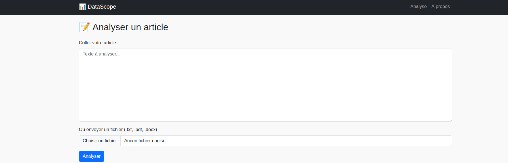

# 🧠 Datascope

[](https://www.python.org/downloads/release/python-3120/)
[](https://flask.palletsprojects.com/)
[](https://datascope.onrender.com/)
[](LICENSE)

## A tool to find data in journalistic articles

**DataScope** est une application conçue pour aider les journalistes à détecter le potentiel "data" caché dans un article. Elle combine traitement NLP et intelligence artificielle pour extraire des entités clés, calculer un score de "datafication", suggérer des angles éditoriaux exploitables et proposer des sources de données pertinentes.

🔗 **App en ligne** : [https://datascope.onrender.com/](https://datascope.onrender.com/)

---

## 🔍 Objectif

Créer une application Flask capable de :
- détecter les entités clés, chiffres, lieux, dates (via NLP local)
- calculer un score de potentiel "data"
- générer des suggestions d’angles journalistiques (via LLM)
- proposer des sources de données ouvertes ou d’APIs à explorer
- permettre l’export de l’analyse (Markdown, JSON)

---

## 🚀 Stack technique

- **Python 3.12**
- **Flask** pour l’interface web
- **spaCy** pour le traitement NLP local
- **OpenAI API** pour la génération d’angles
- **pdfminer / python-docx** pour l’import multiformat
- **pytest** et `black` pour les tests et la qualité de code

---

## 🧩 Structure du projet

```
├── app/         # Flask app (routes, logique web)
├── core/        # Modules de traitement (parser, NLP, LLM)
├── templates/   # Templates Jinja2 HTML
├── static/      # CSS, images
├── tests/       # Fichiers de tests
├── .env.sample  # Exemple de fichier d’environnement
├── requirements.txt
├── README.md
└── run.py       # Point d'entrée
```

---

## 🗂️ Roadmap MVP

- ✅ Initialisation du projet (milestone 1)
- ✅ Analyse NLP de base
- ✅ Génération des angles via LLM
- ✅ Interface Flask et affichage des résultats
- ✅ Export Markdown / JSON
- ✅ Dockerisation et déploiement sur Render

🎯 Chaque étape est suivie via le [GitHub Project Board](https://github.com/hericlibong/Datascope/projects) associé.

---

## 📷 Aperçu de l’interface (optionnel)



---

## 📄 Licence

Ce projet est sous licence MIT. Voir le fichier [LICENSE](LICENSE) pour plus d’informations.
