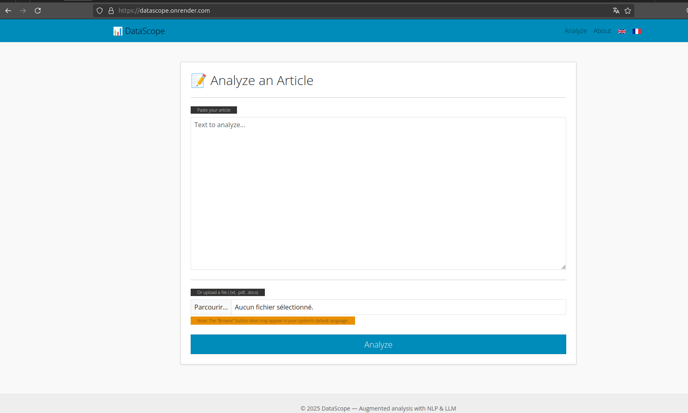

# Datascope

[](https://www.python.org/downloads/release/python-3120/)
[](https://flask.palletsprojects.com/)
[](https://datascope.onrender.com/)
[](LICENSE)

## A tool to reveal the data potential of journalistic articles

**DataScope** is a Flask-based application designed to help journalists identify the “data” potential in a given article. It combines NLP and AI to extract key entities, compute a datafication score, suggest editorial angles, and propose relevant open data sources.

🔗 **Live app**: [https://datascope.onrender.com/](https://datascope.onrender.com/)

---

## Objective

Build a lightweight assistant that:
- Detects key entities, numbers, locations, dates (via local NLP)
- Calculates a “datafication” score
- Generates AI-powered editorial angles (via LLM)
- Suggests open data sources or APIs to explore
- Allows export of the analysis (Markdown, JSON)

> 🔵 Datascope now supports both **French** and **English** articles!  
> (Language selection available via interface)

---

## 🚀 Tech Stack

- **Python 3.12**
- **Flask** for the web interface
- **spaCy** for local NLP processing (`fr_core_news_sm`, `en_core_web_sm`)
- **OpenAI API** for editorial suggestions
- **pdfminer / python-docx** for multi-format input
- **pytest** and `black` for testing and code formatting

---

## 🛠️ Installation & Setup

### 1. Clone the project

```bash
git clone https://github.com/hericlibong/datascope_project.git
cd datascope_project
```

### 2. Local installation (without Docker)

Create and activate a virtual environment:

```bash
python3 -m venv venv
source venv/bin/activate  # Linux / Mac
venv\Scripts\activate     # Windows
```

Install dependencies:

```bash
pip install -r requirements.txt
```

Configure environment variables by copying the sample:

```bash
cp .env.sample .env
```

Edit `.env` to include your OpenAI API key and a secret key for Flask:

```text
OPENAI_API_KEY=your_openai_api_key
FLASK_SECRET_KEY=your_secret_key
```

Run the application:

```bash
python main.py
```

Visit:

```text
http://127.0.0.1:5000
```

---

### 3. Installation via Docker

Quick setup:

```bash
docker-compose up --build
```

Then visit:

```text
http://localhost:5000
```

---

### 4. Running Tests

To run unit and integration tests:

```bash
pytest
```

Enforced quality gates:
- ✅ Minimum 80% coverage (`pytest-cov`)
- ✅ Automatic tests on routes, analysis pipeline, NLP, and export

---

## 🗂️ Project Structure

```
├── app/         # Flask app (routes, views, templates)
├── core/        # Core processing (NLP, LLM, parsing, exports)
├── templates/   # Jinja2 HTML templates
├── static/      # CSS, images, icons
├── uploads/     # Uploaded articles (for analysis)
├── tests/       # Old manual tests
├── tests_pytest/ # Unit and integration tests (pytest)
├── Dockerfile   # Docker config
├── docker-compose.yml
├── .env.sample  # Environment sample
├── requirements.txt
├── README.md
└── main.py      # Entry point
```

---

## 📷 Interface Overview



---

## 📌 Key Points

- **Language support**: French 🇫🇷 and English 🇬🇧
- **Data extraction**: Entities, numbers, dates
- **AI assistance**: Journalistic angles and open data suggestions
- **Simple authentication**: Email-based login
- **Export options**: Markdown download
- **Deployment-ready**: Works on Render.com and other platforms
- **NLP models**: Lightweight for faster deployment
- **Fully tested**: Unit + Integration coverage > 80%

---

## 🔗 Useful Links

- 🔵 Application Live: [https://datascope.onrender.com/](https://datascope.onrender.com/)
- 🔵 Portfolio: [https://hericldev.onrender.com/](https://hericldev.onrender.com/)

---

## 📄 License

This project is licensed under the MIT License. See the [LICENSE](LICENSE) file for details.
